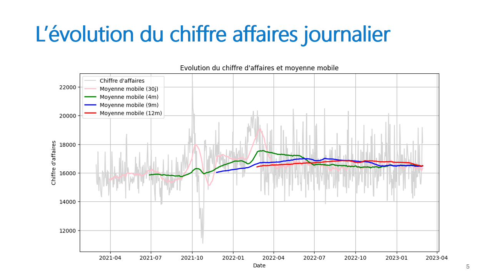
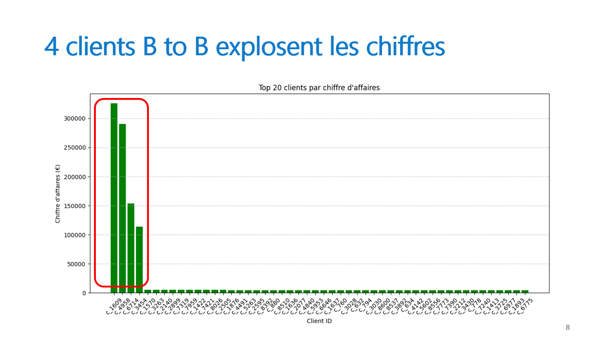
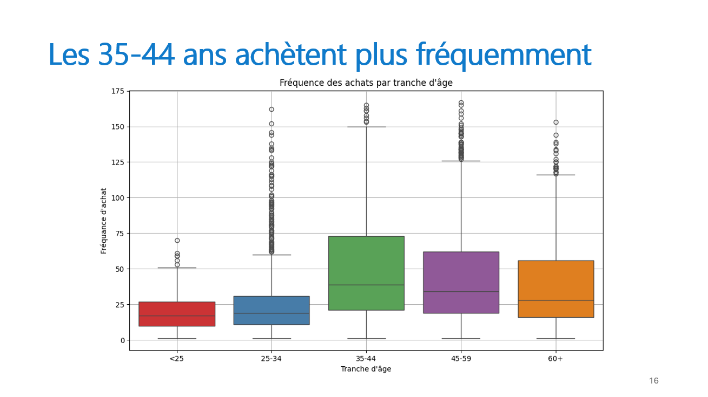
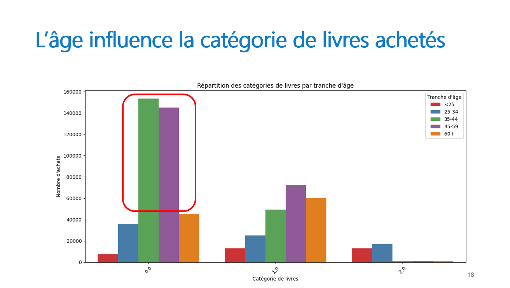
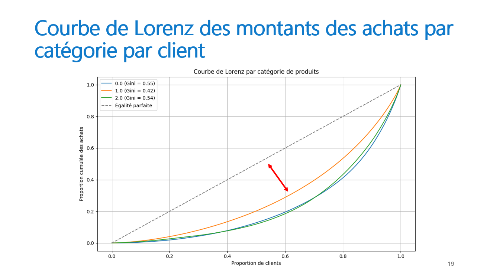

# Projet 9 – Analysez les ventes d'une librairie avec Python

## Contexte du projet

La librairie **Lapage** dispose d’un site e-commerce depuis **deux ans** et souhaite exploiter ses données afin de mieux comprendre ses **indicateurs financiers** et le **comportement de ses clients**.

Dans ce contexte, une mission de **Data Analyst** a été menée afin d’analyser les ventes, d’identifier des tendances significatives et de fournir des recommandations exploitables pour soutenir la prise de décision.

---

## Objectifs pédagogiques

- Analyser un jeu de données comportant des **séries temporelles** afin de mesurer des phénomènes statistiques
- Réaliser des **tests statistiques** pour tester et valider des hypothèses à partir des données

---

## Outils utilisés

- **Python**

---

## Résultats du projet

Toute analyse de données débute par une phase essentielle de **familiarisation**, d’**exploration** et de **nettoyage des données**.

Cette étape a permis d’identifier des **valeurs atypiques**, qui ont été exclues afin de ne pas biaiser les résultats et les analyses futures.  
Ces valeurs provenaient principalement de **clients BtoB**, dont les volumes d’achat étaient significativement plus élevés que ceux des clients particuliers.

### Analyse des indicateurs financiers

- Selon la **granularité temporelle**, les observations diffèrent :
  - Le **chiffre d’affaires quotidien** présente des variations marquées, avec des hausses et des baisses fréquentes
  - Le **chiffre d’affaires mensuel** permet une lecture plus nuancée des tendances globales

### Analyse du comportement des clients

- Le **genre** influence la catégorie de livres achetés.  
  Les femmes achètent davantage que les hommes, mais les **préférences de catégories restent similaires**  
  *(test du khi-deux)*

- Le **montant des achats** diffère selon l’âge :
  - Les **35–44 ans** sont la tranche qui dépense le plus
  - Les **plus de 60 ans** sont ceux qui dépensent le moins  
  *(test ANOVA et test de Tukey)*

- L’**âge influence la fréquence des achats** :
  - Les **35–44 ans** achètent le plus fréquemment
  - Les **moins de 25 ans** achètent le moins souvent  
  *(test ANOVA et test de Tukey)*

- L’**âge a également un impact sur le panier moyen** :
  - Le panier moyen le plus élevé est observé chez les **moins de 25 ans**
  - Les moins de 25 ans achètent moins souvent mais avec un panier plus élevé
  - Les 35–44 ans achètent plus fréquemment mais avec un panier moyen plus faible  
  *(test ANOVA et test de Tukey)*

- En croisant l’**âge** et les **catégories de livres achetés** :
  - Les **35–44 ans** et **45–59 ans** sont surreprésentés dans la catégorie 0
  - Les **35–44 ans**, **45–59 ans** et les **plus de 60 ans** montrent peu d’intérêt pour la catégorie 2  
  *(test du khi-deux et analyse de la valeur p)*

### Analyse des inégalités d’achat

La **courbe de Lorenz** permet de comparer les montants d’achats des clients par catégorie de livres :

- La **catégorie 1** présente l’**indice de Gini le plus faible**
- Les montants d’achats y sont donc les **moins inégalitaires**, contrairement aux catégories 0 et 2

### Recommandations

À la suite de ces analyses financières et comportementales :

- Mettre en place des **actions marketing ciblées**, adaptées à l’**âge des clients**
- Approfondir l’analyse des **clients professionnels (BtoB)** afin de mieux comprendre leurs comportements spécifiques

---

## Compétences acquises

- Utilisation des tests statistiques : **khi-deux**, **ANOVA**, **Tukey**, **courbe de Lorenz**
- Analyse de données **e-commerce**
- Utilisation de **Python** pour réaliser des tests statistiques et des visualisations

---

## Illustrations

### Évolution du chiffre d'affaires journalier

### Top 20 des clients

### Fréquence d'achat par âge

### Catégories de livres par âge

### Courbe de Lorenz

